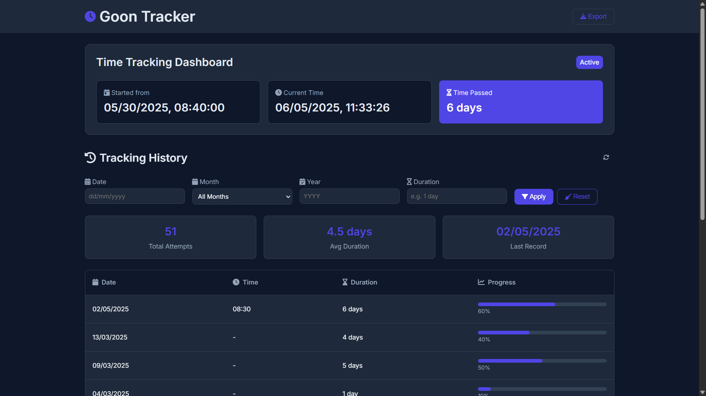

# Goon Tracker - Modern Time Tracking Tool

Goon Tracker is a sleek, modern time tracking application that helps you monitor and analyze your time usage with powerful filtering and visualization features.

## Features

- 🕒 Real-time tracking display
- 📊 Interactive data visualization
- 🔍 Advanced filtering capabilities
- 📱 Fully responsive design
- 📤 Data export functionality
- 📈 Progress tracking metrics

## Technologies Used

- HTML5, CSS3, JavaScript (ES6+)
- Modern CSS with Flexbox and Grid
- Responsive design with mobile-first approach
- Clean, modular JavaScript code
- Optimized for performance and SEO

## Installation

No installation required! Simply open `index.html` in your browser.

For development:

1. Clone this repository
2. Open `index.html` in your browser
3. Start tracking!

## Usage

1. Set your start date in `script.js` (CONFIG.BEGIN_DATE)
2. Add your tracking data to `data.json`
3. Open the application in your browser
4. Use filters to analyze specific time periods

## Customization

You can customize the application by modifying:

- Colors in `:root` CSS variables
- Date format in `CONFIG.DATE_FORMAT_OPTIONS`
- Items per page in `CONFIG.ITEMS_PER_PAGE`

## Browser Support

Goon Tracker works on all modern browsers including:

- Chrome (latest)
- Firefox (latest)
- Safari (latest)
- Edge (latest)

## Contributing

Contributions are welcome! Please open an issue or submit a pull request.

## License

MIT License - see [LICENSE](LICENSE) for details.
